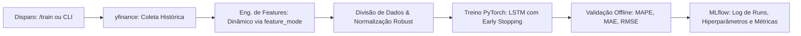
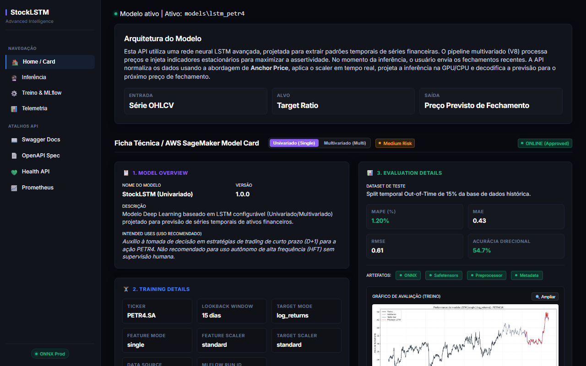
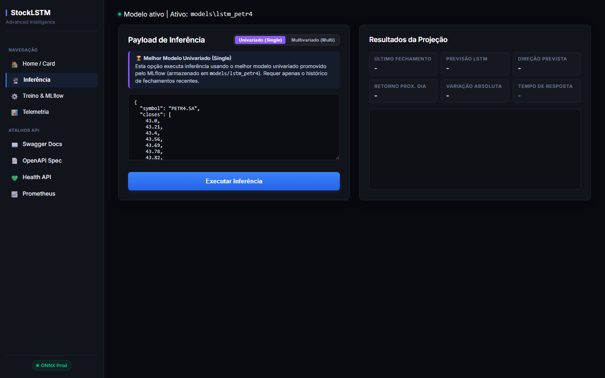
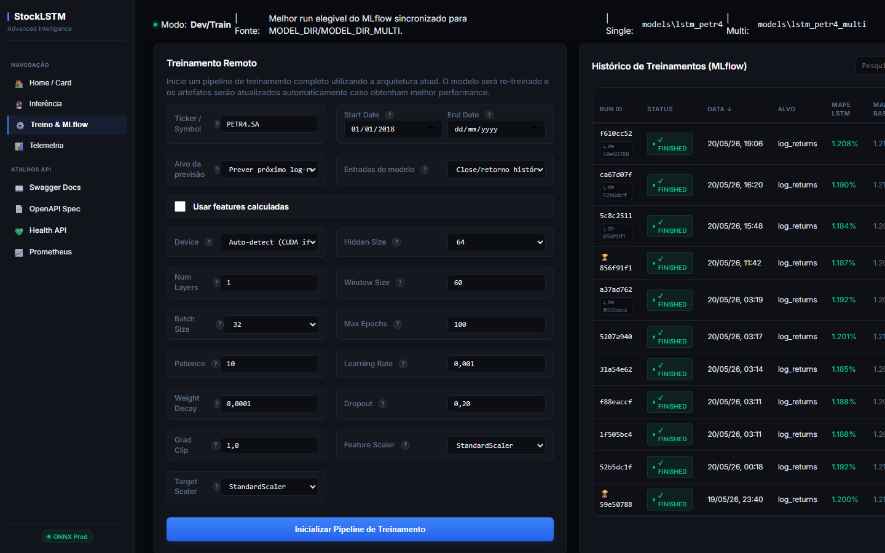
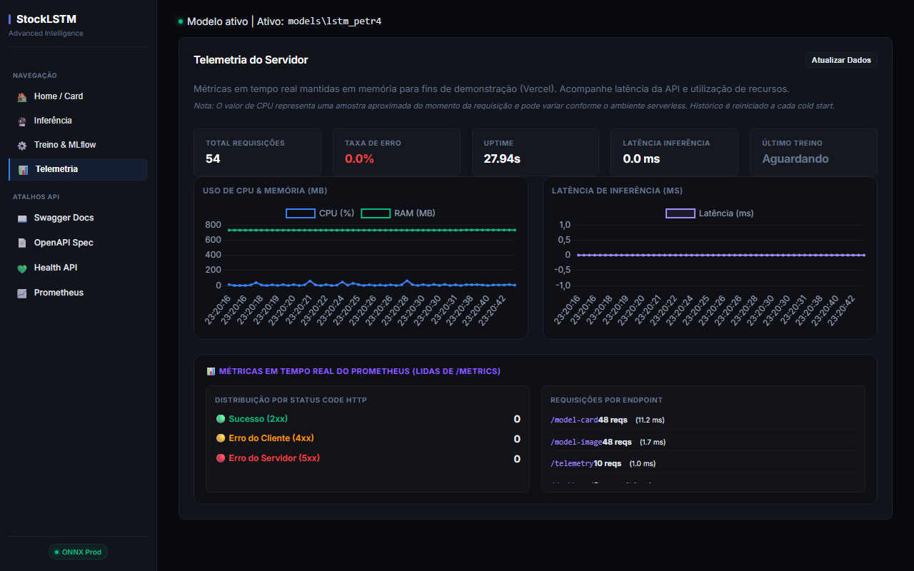

# Tech Challenge Fase 4 - LSTM & MLOps Pipeline

Este projeto implementa uma solução para previsão de preços de fechamento de ações (com foco na PETR4.SA) utilizando Deep Learning (LSTM), com suporte a múltiplos modos de análise (univariado e multivariado) e um ciclo completo de MLOps contendo rastreamento de experimentos com MLflow, empacotamento em ONNX, telemetria integrada e um Dashboard interativo.

O sistema foi arquitetado para rodar em dois modos independentes de instalação e uso, permitindo otimizar o tamanho do contêiner e o consumo de recursos na produção.

## Estrutura do Projeto

```text
src/
  api.py                      # API FastAPI para inferência, telemetria e renderização do Dashboard.
  train/                      # Pacote do pipeline de treinamento:
    __init__.py               # Ponto de entrada e re-exportação de compatibilidade.
    config.py                 # Argumentos e carregamento de configurações de treino.
    data_prep.py              # Pré-processamento, scalers robustos e janelamento de dados.
    trainer.py                # Loop de validação e métricas do modelo (MAE, RMSE, MAPE).
    artifacts.py              # Funções de exportação de plots e metadados.
    pipeline.py               # Orquestrador principal do pipeline e CLI de treino.
  data_loader.py              # Download de dados históricos via yfinance ou leitura de CSV.
  model.py                    # Definição da rede neural LSTM em PyTorch.
  dashboard.html              # Interface do Dashboard interativo.
models/                       # Modelos campeões promovidos para uso na API de inferência:
  lstm_petr4/                 # Pesos e pré-processadores do melhor modelo univariado (single).
  lstm_petr4_multi/           # Pesos e pré-processadores do melhor modelo multivariado.
```

---

## Instalação e Execução

### 1. Modo de Produção (Apenas Inferência)
Focado em baixo consumo de memória, inicialização imediata e segurança. Utiliza o motor **ONNX Runtime** para inferência direta, eliminando a dependência do PyTorch e do MLflow em produção.

- **Instalação das dependências mínimas**:
  ```bash
  poetry install --only main
  ```
- **Executar a API localmente**:
  ```bash
  $env:ENABLE_TRAINING_API="false" ; $env:MODEL_DIR="models/lstm_petr4" ; $env:MODEL_DIR_MULTI="models/lstm_petr4_multi" ; poetry run uvicorn src.api:app --reload
  ```
- **Dashboard Web**: Acesse `http://127.0.0.1:8000/dashboard` para interagir com o modelo, visualizar a telemetria em tempo real e consultar a ficha técnica.
- **Endpoints da API (Swagger / OpenAPI)**:
  A documentação interativa completa está disponível em `http://127.0.0.1:8000/docs` (Swagger) ou `http://127.0.0.1:8000/redoc`. Os endpoints são divididos nas seguintes categorias:
  
  *   **🔮 Inferência**
      *   `POST /predict`: Predição univariada baseada em preços de fechamento anteriores. Consome o modelo de `models/lstm_petr4`.
      *   `POST /predict/ohlcv`: Predição multivariada dinâmica baseada em dados OHLCV completos. Consome o modelo de `models/lstm_petr4_multi`.
  *   **⚙️ Treinamento & MLOps (Disponíveis apenas em Modo Dev/Treinamento)**
      *   `POST /train`: Dispara síncronamente o pipeline de treinamento e registra os artefatos no MLflow.
      *   `GET /runs`: Retorna o histórico de todas as execuções de treinamento gravadas no MLflow.
      *   `DELETE /runs/{run_id}`: Exclui logicamente uma run específica no MLflow.
  *   **📊 Monitoramento, Diagnóstico & Interface**
      *   `GET /dashboard`: Renderiza a interface gráfica do painel de controle.
      *   `GET /health`: Liveness/readiness, retornando o status operacional e pasta de modelos.
      *   `GET /model-card`: Retorna a ficha técnica detalhada do modelo ativo (`?type=single` ou `?type=multi`).
      *   `GET /model-image`: Fornece a imagem PNG contendo o gráfico de perda (Loss) e de performance offline do modelo ativo.
      *   `GET /telemetry`: Retorna métricas brutas de CPU, memória RAM e latência de requisições. Endpoint simples usado pra capturar dados do metrics e guardar em memória a cada interação com o portal. Útil pra demonstrar telemetria no dashboard.
      *   `GET /metrics`: Endpoint de scraping do Prometheus exposto pelo instrumentador de APIs.
- **Build da imagem Docker (Produção / Inferência Empacotada)**:
  A imagem de produção nasce em `ENABLE_TRAINING_API=false` e copia os artefatos de `MODEL_BUNDLE_DIR` para dentro de `/app/models`. Esse é o fluxo para deploy imutável: a API não consulta MLflow e usa apenas o modelo já empacotado.
  ```bash
  docker build \
    --build-arg ENV=prod \
    --build-arg MODEL_BUNDLE_DIR=models \
    --build-arg ENABLE_TRAINING_API=false \
    --build-arg MODEL_DIR=/app/models/lstm_petr4 \
    --build-arg MODEL_DIR_MULTI=/app/models/lstm_petr4_multi \
    -t stock-api:prod .
  ```
  Para executar:
  ```bash
  docker run --rm -p 8000:8000 stock-api:prod
  ```

### 2. Modo de Treinamento e Desenvolvimento
Focado em cientistas de dados para experimentação, novos treinamentos, busca de hiperparâmetros e auditoria de modelos no MLflow. Instala dependências robustas como PyTorch, MLflow e Matplotlib.

#### 1. Pipeline de Treinamento (Técnico)


#### 2. Ciclo MLOps & Arquitetura Macro (Seleção e Endpoints)
```mermaid
flowchart LR
    subgraph Pipeline de Treinamento
        T[Nova run candidata]
    end
    
    subgraph Decisão & Governança (MLOps)
        T --> CVC{Ganho contra baseline > 0?}
        CVC -- Sim --> RANK[Ranking: ganho, acurácia direcional, MAPE e payload]
        CVC -- Não --> FB[Fallback: menor MAPE]
        RANK --> PM[Sincroniza melhor run para models/]
        FB --> PM
    end

    subgraph API Gateway / FastAPI (Endpoints Alimentados)
        PM --> CC[Limpeza de Cache: load_predictor.cache_clear]
        CC --> EP["🔮 Inferência (/predict e /predict/ohlcv)"]
        CC --> MC["📄 Ficha Técnica & Imagem (/model-card e /model-image)"]
        CC --> DB["🖥️ Interface Web (/dashboard)"]
    end
    
    style CVC fill:#f9f,stroke:#333,stroke-width:2px
    style PM fill:#8f8,stroke:#333,stroke-width:2px
```

- **Instalação completa**:
  ```bash
  poetry install
  ```
- **Treinamento via CLI**:
  ```bash
  $env:PYTHONPATH="." ; poetry run python src/train/pipeline.py --symbol PETR4.SA --max-epochs 150 --feature-mode single
  ```
- **Ajuste de Hiperparâmetros (Hyperparameter Tuning)**:
  ```bash
  $env:PYTHONPATH="." ; poetry run python src/tune.py --n-trials 5 --max-epochs 30
  ```
- **Visualização de Experimentos (MLflow UI)**:
  ```bash
  poetry run mlflow ui --backend-store-uri sqlite:///mlflow.db
  ```
  Acesse `http://127.0.0.1:5000` para comparar execuções e visualizar as curvas de perda (loss).
- **Habilitar Treino no Dashboard**:
  Defina a variável `ENABLE_TRAINING_API=true` para liberar o disparo de novos treinos diretamente pela interface gráfica:
  ```bash
  $env:ENABLE_TRAINING_API="true" ; poetry run uvicorn src.api:app --reload
  ```
  Nesse modo dev/train, `/predict` e `/model-card` sincronizam automaticamente o melhor modelo elegível do MLflow para `MODEL_DIR`/`MODEL_DIR_MULTI` antes de carregar os artefatos.
- **Somente Inferência**:
  Defina `ENABLE_TRAINING_API=false` e aponte `MODEL_DIR`/`MODEL_DIR_MULTI` para os artefatos empacotados. Nesse modo a API não consulta MLflow, não promove modelos e usa exatamente o modelo apontado:
  ```bash
  $env:ENABLE_TRAINING_API="false" ; $env:MODEL_DIR="models/lstm_petr4" ; poetry run uvicorn src.api:app
  ```
- **Build da imagem Docker (Treino / Desenvolvimento)**:
  Você pode escolher construir a imagem de desenvolvimento com suporte a CPU ou com GPU (CUDA) para o PyTorch. Nesse modo, a pasta de modelos pode ser montada por volume e apontada por env no runtime:
  *   **Opção 1: Treino em CPU (Leve)** (Recomendado para testes locais sem GPU dedicada):
      ```bash
      docker build \
        --build-arg ENV=dev-cpu \
        --build-arg ENABLE_TRAINING_API=true \
        --build-arg MODEL_DIR=/workspace/models/lstm_petr4 \
        --build-arg MODEL_DIR_MULTI=/workspace/models/lstm_petr4_multi \
        -t stock-api:dev-cpu .

      docker run --rm -p 8000:8000 \
        -e ENABLE_TRAINING_API=true \
        -e MODEL_DIR=/workspace/models/lstm_petr4 \
        -e MODEL_DIR_MULTI=/workspace/models/lstm_petr4_multi \
        -v "$PWD/models:/workspace/models" \
        stock-api:dev-cpu
      ```
  *   **Opção 2: Treino em GPU (CUDA - Pesado)** (Recomendado para treinamento com aceleração de hardware):
      ```bash
      docker build --build-arg ENV=dev-cuda --build-arg ENABLE_TRAINING_API=true -t stock-api:dev-cuda .
      ```

---

## Detalhes Técnicos e Boas Práticas

### Seleção do Melhor Modelo
No modo dev/train, a API sincroniza o melhor modelo elegível do MLflow antes de responder `/predict`, `/predict/ohlcv`, `/model-card` e `/model-image`.

A regra de escolha prioriza utilidade contra o baseline:
1. O modelo precisa superar o baseline persistente (ganho > 0).
2. A seleção prioriza o maior ganho percentual em relação ao baseline. Existe uma **margem de empate de 0.3 ponto percentual**.
3. Modelos dentro dessa margem de empate (0.3%) são desempatados priorizando: **maior acurácia direcional**, depois **menor MAPE** e, por fim, **menor payload de inferência** (menos features).
4. Se nenhuma run superar o baseline, escolhe-se o menor MAPE disponível como fallback.
3. No modo somente inferência, essa sincronização não acontece: a API usa exatamente os artefatos apontados por `MODEL_DIR` e `MODEL_DIR_MULTI`.

### Segurança contra Execução Remota de Código (RCE)
Para contornar as vulnerabilidades do carregador padrão do PyTorch (`torch.load` baseado no formato pickle inseguro), adotamos:
1. **Inferência ONNX**: A API de produção carrega e executa modelos no formato estático do **ONNX Runtime** (`model.onnx`), imune a RCEs.
2. **Safetensors**: O pipeline de treinamento exporta pesos estruturados no formato seguro **`model.safetensors`**, salvando tensores binários estruturados sem execução de código Python arbitrária.

### Telemetria e Monitoramento
- **In-Memory Telemetry**: Latência e utilização de CPU/RAM coletadas via `psutil` e mantidas em buffers rotativos para painéis e deploys serverless.
- **Prometheus**: Endpoint `/metrics` nativo integrado com `prometheus-fastapi-instrumentator` para rastreamento centralizado de tráfego e telemetria de longo prazo.

### Indicadores de Desempenho do Modelo

Para avaliar e comparar a performance dos modelos de previsão, definimos uma hierarquia de métricas de negócio e de engenharia de machine learning:

*   **Métrica Principal (Decisão)**
    *   **Ganho vs Baseline**: Medida de evolução percentual do modelo contra um baseline persistente, onde a previsão de `t+1` é o valor real de `t`. Runs com ganho positivo têm prioridade na seleção automática.
*   **Métricas de Apoio (Acompanhamento)**
    *   **MAPE (Mean Absolute Percentage Error)**: Erro percentual médio absoluto. É usado como desempate e como fallback quando nenhum modelo supera o baseline.
    *   **MAE (Mean Absolute Error)**: Erro médio absoluto expressando os desvios diretamente na escala de preço do ativo (em R$).
    *   **RMSE (Root Mean Squared Error)**: Raiz do erro quadrático médio, utilizada para monitorar a variância dos desvios, penalizando de forma mais rigorosa erros de grande magnitude (outliers).
*   **Métrica Complementar (Direção)**
    *   **Acurácia Direcional (Directional Accuracy)**: Percentual de acerto do sentido de subida ou descida da ação no dia seguinte, crucial para validar a utilidade prática do modelo em estratégias de tomada de decisão.

---

## Telas do Dashboard (Visualização)

Abaixo estão listadas as telas disponíveis no dashboard unificado. Clique em qualquer miniatura para abrir a imagem em tamanho real:

| 🏠 Home / Ficha Técnica | 🔮 Painel de Inferência | ⚙️ Treino & MLflow | 📊 Telemetria do Sistema |
| :---: | :---: | :---: | :---: |
| <a href="assets/home.png"></a> | <a href="assets/inference.png"></a> | <a href="assets/train.png"></a> | <a href="assets/telemetry.png"></a> |

### Home / Card
O card exibe a ficha técnica do modelo ativo, incluindo modo runtime, origem dos artefatos, parâmetros de treino, features usadas, métricas LSTM, baseline e ganho contra baseline.

### Inferência
O painel de inferência permite enviar fechamentos recentes para o modelo univariado ou dados OHLCV para o modelo multivariado e retorna o próximo fechamento previsto.

### Treino & MLflow
O painel de treino fica disponível apenas em modo dev/train. Ele dispara treinamentos, lista runs do MLflow, compara métricas e permite abrir os parâmetros de cada execução.

### Telemetria do Sistema
A tela de telemetria coleta dados do endpoint `/metrics` e exibe informações sobre a latência das requisições, o uso de CPU e memória RAM, e o número de requisições por endpoint.
O intuito dessa tela é demonstrar a capacidade de monitoramento em tempo real da aplicação, facilitando a identificação de gargalos e problemas de performance, sem a necessidade de instalação de ferramentas externas como o Prometheus ou Grafana.

---
*Referências de Pesquisa:*
- [Predicting the Stock Market Using LSTM, XGBoost and Google Trends](https://ijisae.org/index.php/IJISAE/article/view/5396/4121)
- [Stock Prediction Using the LSTM Algorithm with Deep Learning Method](https://etasr.com/index.php/ETASR/article/view/12685/5689)
- [A Comprehensive Study on Stock Price Prediction using LSTM](https://arxiv.org/abs/2303.02223)
- [Kaggle Gold Price Prediction](https://www.kaggle.com/code/farzadnekouei/gold-price-prediction-lstm-96-accuracy)

---
*Projeto desenvolvido para o Tech Challenge FIAP.*
