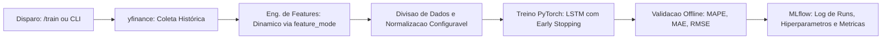
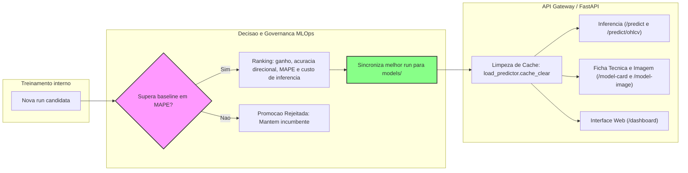

# Tech Challenge Fase 4 - LSTM & MLOps

Este projeto implementa uma solução para previsão de preços de fechamento de ações (com foco na PETR4.SA) utilizando Deep Learning (LSTM), com suporte a múltiplos modos de análise (univariado e multivariado) e um ciclo completo de MLOps contendo rastreamento de experimentos com MLflow, empacotamento em ONNX, telemetria integrada e um Dashboard interativo.

O sistema foi arquitetado para rodar em dois modos independentes de instalação e uso, permitindo otimizar o tamanho do contêiner e o consumo de recursos na produção.

## Estrutura do Projeto

```text
src/
  api.py                      # API FastAPI para inferência, telemetria e renderização do Dashboard.
  frontend/                   # Dashboard modular servido por /dashboard.
    index.html                # Shell HTML do portal.
    main.js                   # Bootstrap dos módulos do frontend.
    modules/                  # Inferência, treino, telemetria, ficha técnica e navegação.
    styles.css                # Estilos do portal.
  train/                      # Implementação interna do treinamento:
    __init__.py               # Ponto de entrada e re-exportação de compatibilidade.
    config.py                 # Argumentos e carregamento de configurações de treino.
    data_prep.py              # Pré-processamento, scalers configuráveis e janelamento de dados.
    trainer.py                # Loop de validação e métricas do modelo (MAE, RMSE, MAPE).
    artifacts.py              # Funções de exportação de plots e metadados.
    pipeline.py               # Orquestrador interno usado pela CLI e pela API.
  train_cli.py                # CLI dedicada para treino com saída operacional e resumo JSON.
  data_loader.py              # Download de dados históricos via yfinance ou leitura de CSV.
  model.py                    # Definição da rede neural LSTM em PyTorch.
models/                       # Modelos campeões promovidos para uso na API de inferência:
  lstm_petr4/                 # Pesos e pré-processadores do melhor modelo univariado (single).
  lstm_petr4_multi/           # Pesos e pré-processadores do melhor modelo multivariado.
```

---

## Instalação e Execução

Eu construi o portal com dois modos diferentes de instalação e execução, otimizando para casos de uso distintos:

- Modo de Produção (Apenas Inferência): Focado em baixo consumo de memória, inicialização imediata e segurança. Utiliza o motor ONNX Runtime para inferência direta, eliminando a dependência do PyTorch e do MLflow em produção.
- Modo de Treinamento e Desenvolvimento: Focado em cientistas de dados para experimentação, novos treinamentos, busca de hiperparâmetros e auditoria de modelos no MLflow. Instala dependências robustas como PyTorch, MLflow e Matplotlib.

### 1. Modo de Produção (Apenas Inferência)

Focado em baixo consumo de memória, inicialização imediata e segurança. Utiliza o motor **ONNX Runtime** para inferência direta, eliminando a dependência do PyTorch e do MLflow em produção.

- **Instalação das dependências mínimas**:

  ```bash
  poetry install --only main
  ```

- **Configuração de variáveis de ambiente**:
  - `ENABLE_TRAINING_API=false` para desabilitar os endpoints de treino e promoção automática.
  - `MODEL_DIR` e `MODEL_DIR_MULTI` apontando para os artefatos ONNX empacotados do modelo univariado e multivariado, respectivamente.

- **Executar a API localmente**:

  ```bash
  $env:ENABLE_TRAINING_API="false" ; $env:MODEL_DIR="models/lstm_petr4" ; $env:MODEL_DIR_MULTI="models/lstm_petr4_multi" ; poetry run uvicorn src.api:app --reload
  ```

- **Dashboard Web**: Acesse `http://127.0.0.1:8000/dashboard` para interagir com o modelo, visualizar a telemetria em tempo real e consultar a ficha técnica.

#### Deploy Serverless (Vercel)

O projeto possui um arquivo `vercel.json` configurado para deploy imediato na Vercel.

Para realizar o deploy:

1. Conecte o repositório na sua conta Vercel.
2. Nenhuma variável de ambiente adicional é necessária para a inferência, pois o código assume os diretórios padrão.

#### Build da imagem Docker (Produção / Inferência Empacotada)

A imagem de produção copia os artefatos de `MODEL_BUNDLE_DIR` para dentro de `/app/models`. Esse é o fluxo para deploy imutável: a API não consulta MLflow e usa apenas o modelo já empacotado.

```bash
docker build --build-arg ENV=prod --build-arg MODEL_BUNDLE_DIR=models --build-arg ENABLE_TRAINING_API=false --build-arg MODEL_DIR=/app/models/lstm_petr4 --build-arg MODEL_DIR_MULTI=/app/models/lstm_petr4_multi -t tech-challenge-api:prod .
```

Para executar:

```bash
docker run --rm -p 8000:8000 tech-challenge-api:prod
```

### 2. Modo de Treinamento e Desenvolvimento

Focado em cientistas de dados para experimentação, novos treinamentos, busca de hiperparâmetros e auditoria de modelos no MLflow. Instala dependências robustas como PyTorch, MLflow e Matplotlib.

#### 1. Fluxo Interno de Treinamento (Técnico)



#### 2. Ciclo MLOps & Arquitetura Macro (Seleção e Endpoints)



- **Instalação completa**:

  ```bash
  poetry install
  ```

- **Treinamento via CLI (execução local)**:

  ```bash
  poetry run python src/train_cli.py --symbol PETR4.SA --max-epochs 150 --feature-mode single
  ```

  Esse modo executa o treino pelo terminal. Ele escreve logs no stdout, registra a run no MLflow, salva artefatos em disco e imprime um resumo final com resposta JSON no próprio terminal.

- **Treinamento via API (resposta estruturada)**:

  Primeiro suba a API com treino habilitado:

  ```bash
  $env:ENABLE_TRAINING_API="true" ; poetry run uvicorn src.api:app --reload
  ```

  Depois dispare o treino por HTTP:

  ```powershell
  Invoke-RestMethod -Method Post -Uri "http://127.0.0.1:8000/train" -ContentType "application/json" -Body '{
    "symbol": "PETR4.SA",
    "max_epochs": 150,
    "feature_mode": "single"
  }'
  ```

  Esse modo retorna JSON com `status`, `metrics`, `output_dir` e `message`, além de atualizar o melhor modelo elegível quando a regra Champion/Challenger aprovar a promoção.

  O parâmetro `end_date`, quando informado, representa a última data desejada no dataset de treino. A execução registra nos metadados e no MLflow a data solicitada, a data real disponível no dataset e as janelas efetivas de treino, validação e teste.

- **Somente Inferência**:
  Defina `ENABLE_TRAINING_API=false` e aponte `MODEL_DIR`/`MODEL_DIR_MULTI` para os artefatos empacotados. Nesse modo a API não consulta MLflow, não promove modelos e usa exatamente o modelo apontado:

  ```bash
  $env:ENABLE_TRAINING_API="false" ; $env:MODEL_DIR="models/lstm_petr4" ; $env:MODEL_DIR_MULTI="models/lstm_petr4_multi" ; poetry run uvicorn src.api:app
  ```

- **Build da imagem Docker (Treino / Desenvolvimento)**:
  Use a imagem de desenvolvimento em CPU. Nesse modo, a pasta de modelos pode ser montada por volume e apontada por env no runtime:
  - **Treino em CPU (Leve)**:

      ```bash
      docker build --build-arg ENV=dev-cpu --build-arg ENABLE_TRAINING_API=true --build-arg MODEL_DIR=/workspace/models/lstm_petr4 --build-arg MODEL_DIR_MULTI=/workspace/models/lstm_petr4_multi -t tech-challenge-api:dev-cpu .

      docker run --rm -p 8000:8000 -e ENABLE_TRAINING_API=true -e MODEL_DIR=/workspace/models/lstm_petr4 -e MODEL_DIR_MULTI=/workspace/models/lstm_petr4_multi -v "$PWD/models:/workspace/models" tech-challenge-api:dev-cpu
      ```

### Endpoints da API (Swagger / OpenAPI)

A documentação interativa completa está disponível em `http://127.0.0.1:8000/docs` (Swagger) ou `http://127.0.0.1:8000/redoc`. Os endpoints são divididos nas seguintes categorias:

#### Inferência / Predict

- `POST /predict`: Predição univariada baseada em preços de fechamento anteriores. Consome o modelo de `models/lstm_petr4`.
- `POST /predict/ohlcv`: Predição multivariada dinâmica baseada em dados OHLCV completos. Consome o modelo de `models/lstm_petr4_multi`.

#### Treinamento & MLOps (SOMENTE DISPONÍVEL EM MODO DEV/TRAIN)

- `POST /train`: Dispara síncronamente o treino e registra os artefatos no MLflow. Disponível apenas em modo dev/train.
- `GET /runs`: Retorna o histórico de todas as execuções de treinamento gravadas no MLflow. Disponível apenas em modo dev/train.
- `DELETE /runs/{run_id}`: Exclui logicamente uma run específica no MLflow. Disponível apenas em modo dev/train.

#### Monitoramento, Diagnóstico & Interface

- `GET /dashboard`: Renderiza a interface gráfica do painel de controle.
- `GET /health`: Liveness/readiness, retornando o status operacional e pasta de modelos.
- `GET /model-card`: Retorna a ficha técnica detalhada do modelo ativo (`?type=single`, `?type=multi` ou `?type=best`).
- `GET /model-champion`: Retorna os campeões atuais por tipo (`single` e `multi`) e o campeão global usado por `type=best`, conforme a regra Champion/Challenger.
- `GET /model-image`: Fornece a imagem PNG contendo o gráfico de perda (Loss) e de performance offline do modelo ativo.
- `GET /telemetry`: Retorna métricas brutas de CPU, memória RAM e latência de requisições. Endpoint simples usado para capturar dados do metrics e guardar em memória a cada interação com o portal. Usado para alimentar os gráficos de telemetria do dashboard sem necessidade de configuração externa de Prometheus/Grafana.
- `GET /metrics`: Endpoint de scraping do Prometheus exposto pelo instrumentador de APIs.

> Tanto `/telemetry` quanto o endpoint `/metrics` são alimentados pela mesma instrumentação interna do `Prometheus`. O `/telemetry` organiza esses dados em JSON para o dashboard, enquanto o `/metrics` expõe no padrão Prometheus.

---

## Detalhes Técnicos e Boas Práticas

### Seleção do Melhor Modelo

No modo dev/train, a API sincroniza os melhores modelos elegíveis do MLflow antes de responder `/predict`, `/predict/ohlcv`, `/model-card`, `/model-champion` e `/model-image`.

A regra de escolha prioriza utilidade contra o baseline:

1. O modelo só entra na disputa se superar o baseline persistente em MAPE.
2. O maior ganho percentual contra o baseline define a faixa principal de seleção.
3. Diferenças de ganho de até **0.3 ponto percentual** são consideradas empate técnico.
4. No empate técnico, vence a maior acurácia direcional.
5. Persistindo o empate, vence o menor MAPE.
6. Depois, vence o modelo que exige menos linhas para inferência.
7. Por fim, vence o menor `window_size`.
8. Se nenhuma run superar o baseline, nenhuma promoção automática é realizada (o modelo atual/incumbente é mantido).
9. No modo somente inferência, essa sincronização não acontece: a API usa exatamente os artefatos apontados por `MODEL_DIR` e `MODEL_DIR_MULTI`.

### Segurança contra Execução Remota de Código (RCE)

Para contornar as vulnerabilidades do carregador padrão do PyTorch (`torch.load` baseado no formato pickle inseguro), adotamos:

1. **Inferência ONNX**: A API de produção carrega e executa modelos no formato estático do **ONNX Runtime** (`model.onnx`), imune a RCEs.
2. **Safetensors**: O treino exporta pesos estruturados no formato seguro **`model.safetensors`**, salvando tensores binários estruturados sem execução de código Python arbitrária.

### Telemetria e Monitoramento

- **In-Memory Telemetry**: Latência e utilização de CPU/RAM coletadas via `psutil` e mantidas em buffers rotativos para painéis e deploys serverless.
- **Prometheus**: Endpoint `/metrics` nativo integrado com `prometheus-fastapi-instrumentator` para rastreamento centralizado de tráfego e telemetria de longo prazo.

### Indicadores de Desempenho do Modelo

Para avaliar e comparar a performance dos modelos de previsão, definimos uma hierarquia de métricas de negócio e de engenharia de machine learning:

- **Métrica Principal (Decisão)**
  - **Ganho vs Baseline**: Medida de evolução percentual do modelo contra um baseline persistente, onde a previsão de `t+1` é o valor real de `t`. Runs com ganho positivo têm prioridade na seleção automática.
- **Métricas de Apoio (Acompanhamento)**
  - **MAPE (Mean Absolute Percentage Error)**: Erro percentual médio absoluto. É usado como critério de entrada contra o baseline e como desempate depois da acurácia direcional.
  - **MAE (Mean Absolute Error)**: Erro médio absoluto expressando os desvios diretamente na escala de preço do ativo (em R$).
  - **RMSE (Root Mean Squared Error)**: Raiz do erro quadrático médio, utilizada para monitorar a variância dos desvios, penalizando de forma mais rigorosa erros de grande magnitude (outliers).
- **Métrica Complementar (Direção)**
  - **Acurácia Direcional (Directional Accuracy)**: Percentual de acerto do sentido de subida ou descida da ação no dia seguinte, crucial para validar a utilidade prática do modelo em estratégias de tomada de decisão.

---

## Telas do Dashboard (Visualização)

Abaixo estão listadas as telas disponíveis no dashboard unificado. Clique em qualquer miniatura para abrir a imagem em tamanho real:

| 🏠 Home / Ficha Técnica | 🔮 Painel de Inferência | ⚙️ Treino & MLflow | 📊 Telemetria do Sistema |
| :---: | :---: | :---: | :---: |
| <a href="assets/home.png"></a> | <a href="assets/inference.png"></a> | <a href="assets/train.png"></a> | <a href="assets/telemetry.png"></a> |

### Home / Card

O card exibe a ficha técnica do modelo ativo, incluindo modo runtime, origem dos artefatos, parâmetros de treino, features usadas, métricas LSTM, baseline e ganho contra baseline.

### Inferência

O painel de inferência permite enviar fechamentos recentes para o modelo univariado ou dados OHLCV para o modelo multivariado e retorna o próximo fechamento previsto.

### Treino & MLflow

O painel de treino fica disponível apenas em modo dev/train. Ele dispara treinamentos, lista runs do MLflow, compara métricas e permite abrir os parâmetros de cada execução.

### Telemetria do Sistema

A tela de telemetria consome o endpoint `/telemetry` e exibe informações sobre a latência das requisições, o uso de CPU e memória RAM, e o número de requisições por endpoint.
O intuito dessa tela é demonstrar a capacidade de monitoramento em tempo real da aplicação, facilitando a identificação de gargalos e problemas de performance, sem a necessidade de instalação de ferramentas externas como o Prometheus ou Grafana.

---
*Referências de Pesquisa:*

- [Predicting the Stock Market Using LSTM, XGBoost and Google Trends](https://ijisae.org/index.php/IJISAE/article/view/5396/4121)
- [Stock Prediction Using the LSTM Algorithm with Deep Learning Method](https://etasr.com/index.php/ETASR/article/view/12685/5689)
- [A Comprehensive Study on Stock Price Prediction using LSTM](https://arxiv.org/abs/2303.02223)
- [Kaggle Gold Price Prediction](https://www.kaggle.com/code/farzadnekouei/gold-price-prediction-lstm-96-accuracy)
- Aulas =)

---
*Projeto desenvolvido para o Tech Challenge FIAP.*
